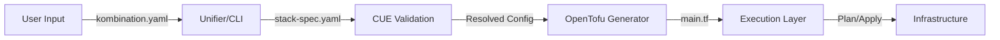

# StackKits Architecture

> **Version:** 3.0
> **Status:** Production Ready

## Overview

StackKits is a declarative infrastructure blueprint system that combines **CUE** for validation, **OpenTofu** for provisioning, and **Terramate** for orchestration. It strictly follows an **IaC-First** approach with a **3-Layer Architecture** for separation of concerns.

## High-Level Data Flow



---

## 3-Layer Architecture (Authoritative)

StackKits uses a strict 3-layer architecture for separation of concerns. Each layer has specific responsibilities and requirements.

```
+------------------------------------------------------------------+
|                    Layer 3: Applications                          |
|   User services deployed BY Layer 2 PAAS (not by Terraform)      |
|   Location: /<stackkit-name>/services.cue                        |
+------------------------------------------------------------------+
                              |
                              v
+------------------------------------------------------------------+
|                    Layer 2: Platform                              |
|   Container orchestration, PAAS, ingress, platform identity      |
|   Location: /base/platform/                                      |
+------------------------------------------------------------------+
                              |
                              v
+------------------------------------------------------------------+
|                    Layer 1: Foundation                            |
|   System, security, packages, core identity (LLDAP, Step-CA)     |
|   Location: /base/                                               |
+------------------------------------------------------------------+
```

### Layer 1: Foundation (Infrastructure)

**Location:** `/base/`

Layer 1 provides the foundation that ALL StackKits build upon. These are immutable infrastructure components that must be configured before anything else.

#### Required Components

| Component | Schema | Description |
|-----------|--------|-------------|
| `system` | `#SystemConfig` | Host configuration (timezone, locale, hostname) |
| `packages` | `#BasePackages` | System packages to install |
| `security.ssh` | `#SSHHardening` | SSH hardening (port, key auth, root login) |
| `security.firewall` | `#FirewallPolicy` | Firewall rules and backend |
| `identity.lldap` | `#LLDAPConfig` | **REQUIRED** - Lightweight LDAP directory |
| `identity.stepCA` | `#StepCAConfig` | **REQUIRED** - Certificate Authority for mTLS |

#### Optional Components

| Component | Schema | Description |
|-----------|--------|-------------|
| `security.container` | `#ContainerSecurityContext` | Container hardening |
| `security.secrets` | `#SecretsPolicy` | Secrets management backend |
| `security.tls` | `#TLSPolicy` | TLS certificate configuration |
| `security.audit` | `#AuditConfig` | Audit logging |

#### Settings Classification

| Setting | Type | Why |
|---------|------|-----|
| `security.ssh.port` | **Perma** | Changing requires firewall and client reconfiguration |
| `security.firewall.backend` | **Perma** | ufw vs iptables have incompatible rule formats |
| `identity.lldap.domain.base` | **Perma** | Changing invalidates all existing identity references |
| `identity.stepCA.pki.rootCommonName` | **Perma** | Changing requires complete PKI rebuild |
| `system.timezone` | Flexible | Can update via `terramate run -- tofu apply` |
| `system.locale` | Flexible | Can update via `terramate run -- tofu apply` |
| `packages.extra` | Flexible | Can update via `terramate run -- tofu apply` |

---

### Layer 2: Platform (Orchestration)

**Location:** `/base/platform/`

Layer 2 manages the container runtime, networking, and platform services. This layer orchestrates how applications are deployed.

#### Required Components

| Component | Schema | Description |
|-----------|--------|-------------|
| `platform` | `#PlatformType` | Platform type: `docker`, `docker-swarm`, `kubernetes`, `bare-metal` |
| `network.defaults` | `#NetworkDefaults` | Network configuration (domain, subnet, driver) |

#### Optional Components

| Component | Schema | Description |
|-----------|--------|-------------|
| `container` | `#ContainerRuntime` | Docker/Podman configuration (required unless bare-metal) |
| `paas` | `#PAASConfig` | PAAS platform: Dokploy, Coolify, Portainer, Dockge |
| `identity` | `#PlatformIdentityConfig` | Platform identity: TinyAuth, PocketID, Authelia, Authentik |
| `ingress` | - | Ingress controller (Traefik default) |

#### PAAS Selection Rule

| Scenario | Default PAAS | Reason |
|----------|--------------|--------|
| No domain (LAN-only / port access) | **Dokploy** | Minimal DNS/SSL assumptions, simpler onboarding |
| Own domain available | **Coolify** | Stronger multi-node story and domain-first workflows |
| Multi-node cluster | **Coolify** | Required for distributed deployments |

This rule is a **default**, not a hard lock: the spec/variant can override it.

#### Platform Identity Services

| Service | Use Case |
|---------|----------|
| **TinyAuth** | Lightweight reverse auth proxy (simple, fast) |
| **PocketID** | Full OIDC provider with LDAP sync |
| **Authelia** | Advanced multi-factor authentication |

#### Settings Classification

| Setting | Type | Why |
|---------|------|-----|
| `platform` | **Perma** | Migration requires workload evacuation |
| `network.defaults.driver` | **Perma** | Changing requires network recreation |
| `paas.type` | **Perma** | Migrating apps between PAAS requires manual export/import |
| `security.tls.mode` | Flexible | Update traefik config and restart |
| `traefik.dashboard.enabled` | Flexible | Update traefik labels |
| `platformIdentity.tinyauth.enabled` | Flexible | Via `terramate run -- tofu apply` |

---

### Layer 3: Applications (User Services)

**Location:** `/<stackkit-name>/services.cue`

Layer 3 contains user applications that are deployed **BY** the Layer 2 PAAS, not directly by Terraform. This separation ensures applications can be managed through the PAAS UI while infrastructure remains IaC-managed.

#### Key Principle

> **Applications are managed by PAAS, not by Terraform.**
>
> Layer 2 services (Traefik, Dokploy, TinyAuth) are deployed via Terraform.
> Layer 3 services (Uptime Kuma, Whoami, custom apps) are deployed via Dokploy/Coolify.

#### Service Classification

| Category | Layer | Managed By |
|----------|-------|------------|
| Reverse Proxy (Traefik) | 2-platform | Terraform |
| PAAS (Dokploy, Coolify) | 2-platform | Terraform |
| Platform Identity (TinyAuth) | 2-platform | Terraform |
| Observability (Dozzle) | 2-platform | Terraform |
| Monitoring (Uptime Kuma) | 3-application | Dokploy |
| Custom Applications | 3-application | Dokploy |
| Test Services (Whoami) | 3-application | Dokploy |

#### Settings Classification

| Setting | Type | Why |
|---------|------|-----|
| All application config | Flexible | Managed entirely through PAAS dashboard |

---

## Lifecycle Modes

### Default Mode (Day-1 Only)

Uses pure **OpenTofu** for initial provisioning.

```bash
# Lifecycle
tofu init -> tofu plan -> tofu apply
```

Best for:
- Single-stack, single-server setups
- Users who don't need ongoing drift detection
- Simple homelab deployments

### Advanced Mode (Day-1 + Day-2)

Uses **Terramate** to orchestrate OpenTofu for ongoing management.

```bash
# Day-1: Initial deployment
terramate run -- tofu init
terramate run -- tofu plan
terramate run -- tofu apply

# Day-2: Ongoing management
terramate run -- tofu plan  # Drift detection
terramate run -- tofu apply # Apply changes
```

Features:
- **Drift detection**: Detect and reconcile configuration drift
- **Change sets**: Review changes before applying
- **Rolling updates**: Staged deployment across nodes
- **Stack ordering**: Dependency-aware execution

---

## StackKit Add-Ons

Add-ons extend Layer 2/3 capabilities without modifying Layer 1 foundation.

### Examples

| Add-on | Layer Modified | Description |
|--------|---------------|-------------|
| `monitoring-addon` | 3 | Adds Prometheus, Grafana, Alertmanager |
| `backup-addon` | 2 | Adds Restic backup with S3/B2 support |
| `vpn-addon` | 2 | Adds WireGuard/Tailscale VPN overlay |
| `ci-cd-addon` | 3 | Adds Gitea, Drone CI, ArgoCD |

### Add-on Rules

1. Add-ons **MUST NOT** modify Layer 1 (foundation) settings
2. Add-ons **MAY** add Layer 2 services (platform)
3. Add-ons **MAY** add Layer 3 applications
4. Add-ons **MUST** be compatible with existing PAAS selection

---

## Directory Structure

```
/
├── base/                   # Layer 1: Foundation Schemas
│   ├── stackkit.cue       # Base StackKit definition
│   ├── system.cue         # System configuration
│   ├── network.cue        # Network defaults
│   ├── security.cue       # Security hardening
│   ├── identity.cue       # Layer 1 identity (LLDAP, Step-CA)
│   ├── observability.cue  # Logging, metrics, health
│   ├── validation.cue     # Reusable validators
│   ├── layers.cue         # 3-Layer validation schema
│   └── platform/          # Layer 2: Platform Schemas
│       ├── paas.cue       # PAAS configuration
│       └── identity.cue   # Platform identity (TinyAuth, etc.)
│
├── <stackkit-name>/       # Layer 3: StackKit Definition
│   ├── stackfile.cue      # Main schema extension
│   ├── services.cue       # Service definitions
│   ├── defaults.cue       # Opinionated defaults
│   └── variants/          # OS and compute variants
│
├── kombify-admin/         # Admin Backend Schema
│   └── prisma/            # Prisma schema (DB is master)
│
├── docs/                  # Documentation
├── ADR/                   # Architecture Decision Records
├── cmd/                   # CLI Source Code (Go)
└── internal/              # Internal Logic Packages
```

---

## Validation

### Layer Validation Schema

```cue
#ValidatedStackKit: {
    // Layer 1: Foundation (embedded, REQUIRED)
    #Layer1Foundation

    // Layer 2: Platform (embedded, REQUIRED)
    #Layer2Platform

    // Layer 3: Applications (embedded, REQUIRED)
    #Layer3Applications

    // Metadata requirements
    metadata: #StackKitMetadata
}
```

### Running Validation

```bash
# Validate base schemas
cue vet ./base/...

# Validate specific StackKit
cue vet ./base/... ./base-homelab/...

# Validate all StackKits
for stack in base-homelab dev-homelab modern-homelab; do
    cue vet ./base/... ./$stack/...
done
```

---

## Service Labels

All services MUST have layer classification labels:

```cue
labels: {
    "stackkit.layer":      "2-platform" | "3-application"
    "stackkit.managed-by": "terraform" | "dokploy" | "coolify"
}
```

---

## Related Documentation

- [SETTINGS-CLASSIFICATION.md](./SETTINGS-CLASSIFICATION.md) - Perma vs flexible settings
- [ADR-0003-paas-strategy.md](../ADR/ADR-0003-paas-strategy.md) - PAAS selection decision
- [creating-stackkits.md](./creating-stackkits.md) - StackKit authoring guide
- [stack-spec-reference.md](./stack-spec-reference.md) - Spec schema reference
