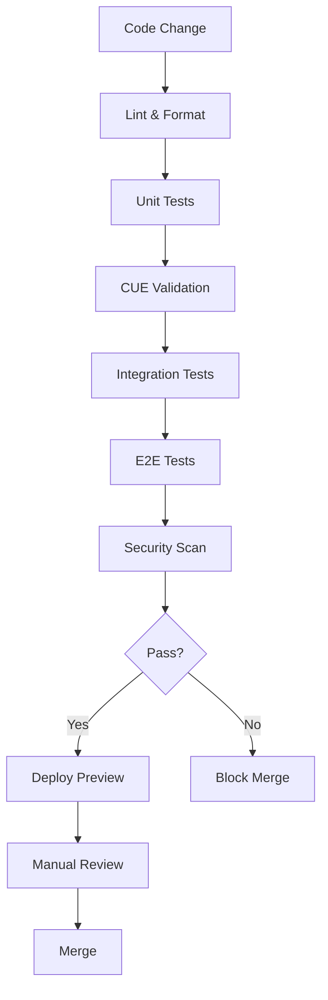

# StackKit Layer: base-homelab Plan & Roadmap

**Scope:** This document defines the implementation roadmap, improvements, and technical debt for the base-homelab StackKit.

---

## 1. Current State Assessment

### 1.1 Implemented Features

| Feature | Status | Notes |
|---------|--------|-------|
| CUE Schema Definitions | ✅ Complete | `base/`, `base-homelab/` directories |
| Service Definitions | ✅ Complete | 9 services defined |
| Variant Support | 🔄 Partial | Defined but not fully tested |
| Template Generation | 🔄 Partial | Basic templates exist |
| OpenTofu Integration | ❌ Missing | Only templates, no working code |
| CLI Commands | ❌ Missing | Go CLI not implemented |
| Validation Pipeline | 🔄 Partial | CUE validation only |
| Documentation | 🔄 Partial | Mixed quality |

### 1.2 Technical Debt Inventory

| Item | Priority | Effort | Impact |
|------|----------|--------|--------|
| CLI not implemented | High | Large | Blocks automation |
| No end-to-end tests | High | Medium | Reliability |
| OpenTofu code incomplete | High | Large | Core functionality |
| Inconsistent docs | Medium | Medium | Usability |
| No CI/CD pipeline | Medium | Medium | Quality |
| Missing health checks | Medium | Small | Operations |
| Hard-coded values | Low | Small | Flexibility |

---

## 2. Implementation Roadmap

### 2.1 Phase 1: Foundation (Week 1-2)

**Goal:** Establish working CLI and validation pipeline

```
Week 1:
├── Day 1-2: CLI Scaffolding
│   ├── Initialize Go module
│   ├── Implement Cobra commands
│   └── Add configuration loading
│
├── Day 3-4: Validation Integration
│   ├── CUE runtime integration
│   ├── Multi-stage validation
│   └── Error formatting
│
└── Day 5: Testing
    ├── Unit tests for validators
    └── Integration tests

Week 2:
├── Day 1-2: OpenTofu Generation
│   ├── Template engine
│   ├── main.tf generation
│   └── variables.tf generation
│
├── Day 3-4: Execution Engine
│   ├── tofu init/plan/apply
│   ├── State management
│   └── Error handling
│
└── Day 5: Documentation
    └── CLI usage docs
```

### 2.2 Phase 2: Core Features (Week 3-4)

**Goal:** Complete service deployment lifecycle

```
Week 3:
├── Day 1-2: Service Templates
│   ├── Traefik configuration
│   ├── Dokploy/Coolify setup
│   └── Monitoring stack
│
├── Day 3-4: Network Configuration
│   ├── Network creation
│   ├── Subnet allocation
│   └── DNS integration
│
└── Day 5: Volume Management
    ├── Volume provisioning
    └── Backup hooks

Week 4:
├── Day 1-2: Health Checks
│   ├── HTTP/TCP checks
│   ├── Dependency checks
│   └── Status reporting
│
├── Day 3-4: Variant Implementation
│   ├── Minimal variant
│   ├── Standard variant
│   └── Full variant
│
└── Day 5: Integration Testing
    └── End-to-end tests
```

### 2.3 Phase 3: Operations (Week 5-6)

**Goal:** Production-ready operations

```
Week 5:
├── Day 1-2: Monitoring Integration
│   ├── Prometheus metrics
│   ├── Log aggregation
│   └── Alert configuration
│
├── Day 3-4: Backup System
│   ├── Volume snapshots
│   ├── Configuration backup
│   └── Restore procedures
│
└── Day 5: Security Hardening
    ├── Secret management
    └── TLS configuration

Week 6:
├── Day 1-2: CI/CD Pipeline
│   ├── GitHub Actions
│   ├── Automated testing
│   └── Release workflow
│
├── Day 3-4: Documentation
│   ├── User guide
│   ├── API reference
│   └── Troubleshooting
│
└── Day 5: Release
    └── v1.0.0-rc1
```

---

## 3. Feature Specifications

### 3.1 CLI Commands (To Implement)

```bash
# Core lifecycle
stackkit init [path] --variant <minimal|standard|full>
stackkit validate [path] --strict
stackkit prepare [path] --output <dir>
stackkit plan [path]
stackkit apply [path] --auto-approve
stackkit destroy [path] --force
stackkit status [path]

# Service management
stackkit service list [path]
stackkit service logs <service> --tail <n>
stackkit service restart <service>
stackkit service stop <service>
stackkit service start <service>

# Backup & restore
stackkit backup create [path]
stackkit backup list [path]
stackkit backup restore <backup-id>

# Configuration
stackkit config show [path]
stackkit config set <key> <value>
stackkit config validate [path]
```

### 3.2 Configuration File Structure

```yaml
# stackkit.yaml - Target structure
apiVersion: stackkits.io/v1
kind: StackKit
metadata:
  name: my-homelab
  version: 1.0.0

spec:
  variant: standard
  domain: home.local
  
  hardware:
    ram: 8G
    cpu: 4
    disk: 100G
  
  network:
    subnet: 172.20.0.0/24
    gateway: 172.20.0.1
    dns:
      - 1.1.1.1
      - 8.8.8.8
  
  tls:
    provider: letsencrypt
    email: admin@example.com
    staging: false
  
  services:
    traefik:
      enabled: true
      dashboard: true
      
    dokploy:
      enabled: true
      
    uptime_kuma:
      enabled: true
      
  backup:
    enabled: true
    schedule: "0 2 * * *"
    retention: 7d
    
  monitoring:
    enabled: true
    alerts: true
```

---

## 4. Improvements Backlog

### 4.1 High Priority

| ID | Title | Description | Acceptance Criteria |
|----|-------|-------------|---------------------|
| IMP-001 | Go CLI Implementation | Implement core CLI commands | All lifecycle commands work |
| IMP-002 | OpenTofu Generation | Generate valid Tofu code | tofu plan succeeds |
| IMP-003 | End-to-End Tests | Automated deployment tests | Tests pass in CI |
| IMP-004 | Variant Selection | Interactive variant wizard | CLI guides user through selection |
| IMP-005 | Health Check System | Implement health checks | All services have checks |

### 4.2 Medium Priority

| ID | Title | Description | Acceptance Criteria |
|----|-------|-------------|---------------------|
| IMP-010 | Backup Automation | Scheduled backups | Backups run on schedule |
| IMP-011 | Log Aggregation | Centralized logging | Logs searchable |
| IMP-012 | Secret Management | Secure secret storage | No plaintext secrets |
| IMP-013 | Update Mechanism | Service update workflow | Zero-downtime updates |
| IMP-014 | Rollback Support | Deployment rollback | Can rollback to previous |

### 4.3 Low Priority

| ID | Title | Description | Acceptance Criteria |
|----|-------|-------------|---------------------|
| IMP-020 | Web Dashboard | Admin web UI | Basic CRUD operations |
| IMP-021 | Notification System | Alert notifications | Email/Slack alerts |
| IMP-022 | Plugin System | Extensible services | Custom services work |
| IMP-023 | Multi-Host Support | Distributed deployment | Works across hosts |
| IMP-024 | GPU Support | GPU passthrough | GPU containers work |

---

## 5. Quality Gates

### 5.1 Pre-Release Checklist

```markdown
## v1.0.0 Release Checklist

### Code Quality
- [ ] All tests pass (unit, integration, e2e)
- [ ] Code coverage > 80%
- [ ] No critical security vulnerabilities
- [ ] No high-severity linter warnings

### Documentation
- [ ] README updated
- [ ] CLI help text complete
- [ ] API documentation generated
- [ ] Troubleshooting guide written

### Testing
- [ ] Tested on minimal hardware (2GB RAM)
- [ ] Tested on standard hardware (8GB RAM)
- [ ] Tested on all variants
- [ ] Recovery procedures verified

### Operations
- [ ] Backup/restore tested
- [ ] Health checks functional
- [ ] Monitoring operational
- [ ] Logs properly formatted

### Security
- [ ] No default passwords
- [ ] TLS properly configured
- [ ] Secrets encrypted
- [ ] Docker socket properly secured
```

### 5.2 Validation Pipeline



---

## 6. Migration Strategy

### 6.1 From Docker Compose

```bash
# Step 1: Export existing configuration
stackkit migrate from-compose ./docker-compose.yml

# Step 2: Review generated stackkit.yaml
stackkit validate ./stackkit.yaml

# Step 3: Plan migration
stackkit plan --preview

# Step 4: Apply with backup
stackkit apply --backup

# Step 5: Verify
stackkit status
```

### 6.2 Upgrade Path

```
v0.x → v1.0:
├── Backup existing data
├── Export configuration
├── Install new CLI
├── Migrate config format
├── Validate new config
└── Apply with --migrate flag

v1.x → v2.x (future):
├── Auto-migration support
├── Config version detection
└── Gradual rollout
```

---

## 7. Risk Assessment

### 7.1 Technical Risks

| Risk | Probability | Impact | Mitigation |
|------|-------------|--------|------------|
| OpenTofu breaking changes | Medium | High | Pin versions, test upgrades |
| Docker API changes | Low | Medium | Abstract Docker interaction |
| CUE language changes | Low | Low | Pin CUE version |
| Resource exhaustion | Medium | High | Implement resource limits |
| Data loss | Low | Critical | Backup automation |

### 7.2 Operational Risks

| Risk | Probability | Impact | Mitigation |
|------|-------------|--------|------------|
| Deployment failure | Medium | High | Rollback automation |
| Service unavailability | Medium | Medium | Health checks, restart |
| Configuration drift | High | Medium | GitOps, validation |
| Security breach | Low | Critical | Hardening, monitoring |

---

## 8. Success Metrics

### 8.1 Development Metrics

| Metric | Target | Current |
|--------|--------|---------|
| Code Coverage | > 80% | 0% |
| Build Success Rate | > 99% | N/A |
| Time to First Deploy | < 15 min | N/A |
| Documentation Coverage | 100% | ~40% |

### 8.2 Operational Metrics

| Metric | Target | Current |
|--------|--------|---------|
| Deployment Success Rate | > 95% | N/A |
| Mean Time to Recovery | < 5 min | N/A |
| Service Availability | > 99.5% | N/A |
| Backup Success Rate | 100% | N/A |

---

## 9. Dependencies

### 9.1 External Dependencies

| Dependency | Version | Purpose |
|------------|---------|---------|
| Go | >= 1.22 | CLI implementation |
| CUE | >= 0.7 | Schema validation |
| OpenTofu | >= 1.6 | Infrastructure |
| Docker | >= 24.0 | Container runtime |
| PostgreSQL | >= 15 | Admin database |

### 9.2 Internal Dependencies

| Component | Depends On | Status |
|-----------|------------|--------|
| CLI | CUE, OpenTofu | ❌ Not started |
| Validation | CUE schemas | ✅ Partial |
| Generation | Templates | 🔄 Partial |
| Execution | OpenTofu | ❌ Not started |
| Monitoring | Services | ❌ Not started |

---

## References

- **Contract:** [base-homelab Contract](./CONTRACT.md)
- **Validation:** [base-homelab Validation](./VALIDATION.md)
- **Foundation:** [Layer 1 Automation](../../layer-1-foundation/base/AUTOMATION.md)
