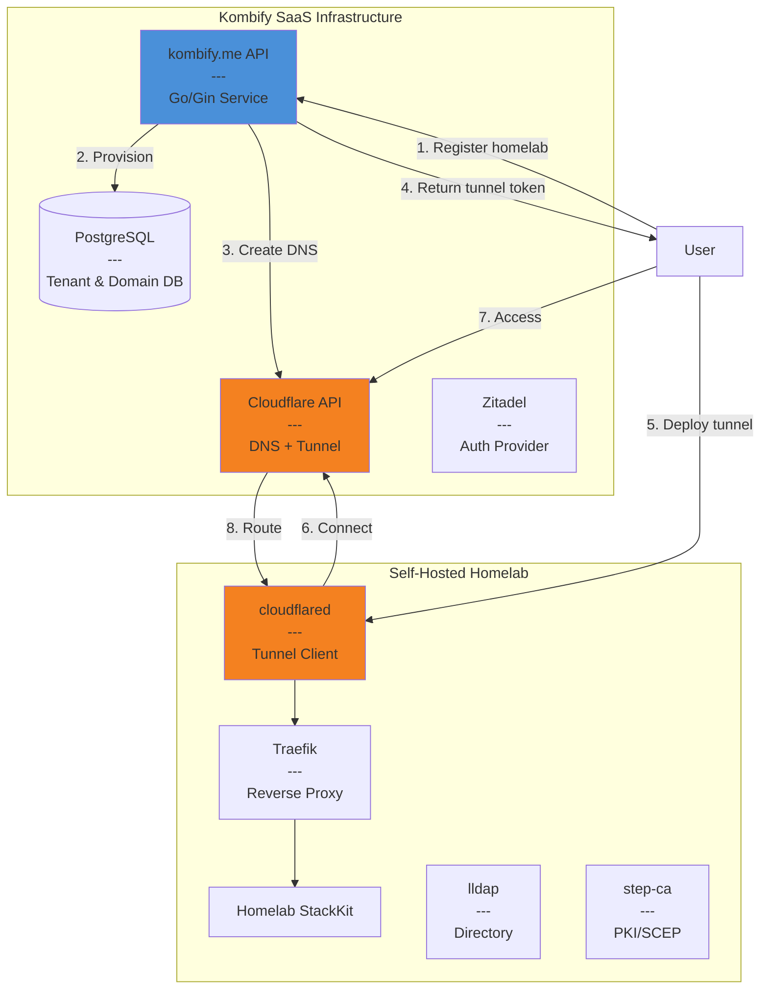
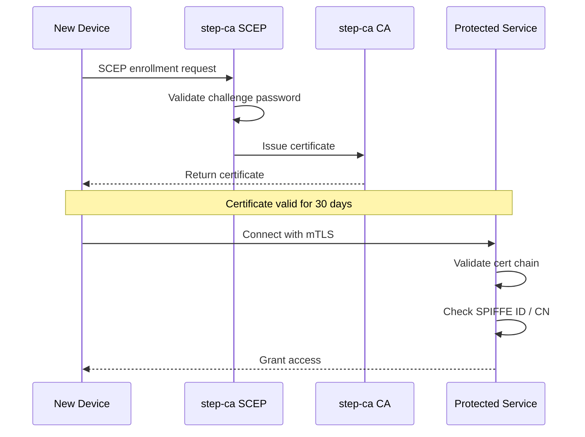

# kombify.me Service Architecture & Implementation Plan

**Status:** Draft  
**Created:** 2026-01-29  
**Author:** Architect Mode Analysis  

---

## Executive Summary

This document defines the architecture for **kombify.me** - a SaaS service providing automatic subdomain provisioning and magic links for self-hosted homelabs. It also assesses the current state of LLDAP and SCEP/step-ca deployment gaps identified in the Identity Plan.

### Key Decisions Made

| Decision | Choice | Rationale |
|----------|--------|-----------|
| kombify.me model | **SaaS** | Kombify manages DNS/tunnel infrastructure; users get automatic subdomains |
| LLDAP deployment | **Per-homelab** | Data sovereignty; local directory as source of truth |
| step-ca deployment | **Per-homelab** | Certificate autonomy; SCEP for local device enrollment |
| Tunnel technology | **Cloudflare Tunnel** | Mature, zero-trust compatible, easy integration |
| DNS provider | **Cloudflare** | API-first, integrated with tunnels, global CDN |

---

## 1. Current State Assessment

### 1.1 kombify.me Service: NOT IMPLEMENTED

**Gap:** No automated subdomain provisioning exists. Users manually configure domains or use IP:port access.

**Requirements from Identity Plan:**
- Public services from homelab need secure edge exposure
- Cloudflare Tunnels mentioned as preferred "secure edge" solution
- Need subdomain schema for service discovery

### 1.2 LLDAP: NOT DEPLOYED

**Gap:** Identity Plan specifies lldap as directory service, but no StackKit currently deploys it.

**Current State:**
- Defined in [`base/security.cue`](../../base/security.cue:407) as `#PKIConfig`
- Referenced in [`IDENTITY-PROFILES.md`](../../missions/layer-3-stackkits/IDENTITY-PROFILES.md:160) for all StackKits except dev-homelab
- Not present in any `default-spec.yaml`

**Deployment Target:**
| StackKit | lldap Required | Status |
|----------|---------------|--------|
| dev-homelab | Yes (password auth) | ❌ Missing |
| base-homelab | Yes | ❌ Missing |
| modern-homelab | Yes | ❌ Missing |
| ha-homelab | Yes | ❌ Missing |

### 1.3 SCEP/step-ca: NOT DEPLOYED

**Gap:** Certificate Authority infrastructure missing. mTLS and device trust cannot be enforced.

**Current State:**
- Defined in [`base/security.cue`](../../base/security.cue:407) as `#PKIConfig`
- Referenced in Identity Plan for mTLS device trust
- Required for `modern-homelab` and `ha-homelab` profiles

**Blocking:** Zero-trust device trust (`requireCert: true`) cannot be implemented without step-ca.

---

## 2. kombify.me Service Architecture

### 2.1 High-Level Architecture



### 2.2 Subdomain Allocation Schema

```
Format: <service>.<homelab-id>.kombify.me

Examples:
- kuma.lab42.kombify.me       → Uptime Kuma for lab42
- dokploy.lab42.kombify.me    → Dokploy PaaS for lab42  
- grafana.lab42.kombify.me    → Grafana dashboards
- api.lab42.kombify.me        → Custom API endpoint
```

**Homelab ID Generation:**
- Short, unique identifiers (e.g., `lab42`, `a7x9k2`)
- Auto-generated on registration
- User can customize if available
- 6-character minimum for collision resistance

**Service Discovery:**
- Services register with kombify.me API on deployment
- StackKit integration auto-detects exposed services
- Users can manually add custom endpoints

### 2.3 Service Components

#### A. kombify.me API Service

```yaml
Service: kombify-me-api
Language: Go (Gin framework)
Database: PostgreSQL
Cache: Redis (for tunnel status, rate limiting)

Endpoints:
  # Authentication
  POST   /api/v1/auth/register          # New user registration
  POST   /api/v1/auth/login             # OAuth2/OIDC login via Zitadel
  
  # Homelab Management  
  POST   /api/v1/homelabs                # Register new homelab
  GET    /api/v1/homelabs/:id            # Get homelab details
  DELETE /api/v1/homelabs/:id            # Deregister homelab
  
  # Domain Management
  POST   /api/v1/homelabs/:id/services   # Add service endpoint
  DELETE /api/v1/homelabs/:id/services/:service  # Remove endpoint
  GET    /api/v1/homelabs/:id/tunnel-token       # Get tunnel credentials
  
  # Magic Links
  POST   /api/v1/magic-links             # Create time-limited magic link
  GET    /api/v1/magic-links/:token      # Validate and redirect
```

#### B. Cloudflare Integration

```yaml
DNS Automation:
  Provider: Cloudflare API
  Record Type: CNAME
  Target: <tunnel-id>.cfargotunnel.com
  
Tunnel Management:
  Type: Named Tunnel
  Per-homelab: One tunnel per homelab
  High-Availability: Multiple cloudflared replicas possible
  
SSL/TLS:
  Mode: Full (strict)
  Certificates: Cloudflare-managed (no Let's Encrypt needed)
  Edge Certificates: Universal SSL (auto-provisioned)
```

#### C. StackKit Integration

```yaml
# New stack-spec.yaml section
kombify:
  enabled: true
  homelab_id: "lab42"           # Auto-generated or user-defined
  domain: "lab42.kombify.me"    # Auto-assigned
  
  services:
    - name: uptime-kuma
      subdomain: kuma           # → kuma.lab42.kombify.me
      internal_port: 3001
      
    - name: dokploy
      subdomain: dokploy        # → dokploy.lab42.kombify.me
      internal_port: 3000
      
  tunnel:
    auto_configure: true        # StackKit deploys cloudflared
    token_source: kombify_api   # Fetch from kombify.me service
```

---

## 3. LLDAP Deployment Model

### 3.1 Architecture Decision: Per-Homelab

**Rationale:**
1. **Data Sovereignty:** User directory stays in user's control
2. **Offline Operation:** Homelab functions without internet
3. **Privacy:** Passkey data and groups never leave local network
4. **Simplicity:** No multi-tenant LDAP complexity

### 3.2 Deployment Configuration

```yaml
# Add to base-homelab/default-spec.yaml
services:
  - name: lldap
    type: identity-directory
    node: homelab-server
    image: lldap/lldap:stable
    ports:
      - 17170:17170  # Web UI
      - 389:3890     # LDAP (non-TLS)
      - 636:6360     # LDAPS (TLS)
    volumes:
      - /opt/kombistack/lldap/data:/data
    env:
      LLDAP_JWT_SECRET: "${LLDAP_JWT_SECRET}"  # Generated
      LLDAP_LDAP_USER_PASS: "${LLDAP_ADMIN_PASS}"  # User-defined
      LLDAP_BASE_DN: "dc=homelab,dc=local"
    labels:
      kombistack.service: lldap
      kombistack.managed: "true"
      traefik.enable: "true"
      traefik.http.routers.lldap.rule: Host(`lldap.local`)
      traefik.http.services.lldap.loadbalancer.server.port: "17170"
```

### 3.3 Schema Design

```ldif
# Base Structure
dc=homelab,dc=local
├── ou=users
│   ├── uid=admin (emergency access)
│   ├── uid=owner (primary operator)
│   └── uid=operator
├── ou=groups
│   ├── cn=owners (full access)
│   ├── cn=operators (deploy, monitor)
│   ├── cn=developers (deploy, logs)
│   └── cn=viewers (read-only)
└── ou=service-accounts
    ├── uid=stackkit-worker
    └── uid=monitoring-agent
```

### 3.4 Integration Points

| Component | Integration | Purpose |
|-----------|-------------|---------|
| pocketid | LDAP backend | User authentication |
| tinyauth | LDAP groups | RBAC claims |
| Traefik | ForwardAuth | Service access control |
| Grafana | LDAP auth | Dashboard login |

---

## 4. step-ca/SCEP Deployment Model

### 4.1 Architecture Decision: Per-Homelab

**Rationale:**
1. **Certificate Autonomy:** User controls their own PKI
2. **Offline Enrollment:** Devices enroll without cloud dependency
3. **Trust Domain Isolation:** Each homelab is separate trust domain
4. **SCEP Simplicity:** Standard protocol for device enrollment

### 4.2 Deployment Configuration

```yaml
# Add to modern-homelab/default-spec.yaml
services:
  - name: step-ca
    type: pki-authority
    node: k3s-control
    image: smallstep/step-ca:latest
    ports:
      - 9000:9000  # CA endpoint
    volumes:
      - /opt/kombistack/step-ca/certs:/home/step/certs
      - /opt/kombistack/step-ca/config:/home/step/config
      - /opt/kombistack/step-ca/secrets:/home/step/secrets
    env:
      STEPCA_INIT_NAME: "${STACK_NAME}-CA"
      STEPCA_INIT_DNS_NAMES: "step-ca,localhost,${NODE_IP}"
      STEPCA_INIT_PROVISIONER_NAME: "admin"
    labels:
      kombistack.service: step-ca
      kombistack.managed: "true"
```

### 4.3 Certificate Hierarchy

```
Root CA (offline, backup only)
└── Intermediate CA (step-ca instance)
    ├── Server Certificates (Traefik, services)
    ├── Client Certificates (admin devices, mTLS)
    ├── SCEP Enrollment (auto-enrolled devices)
    └── SPIFFE Identities (workload identities)
```

### 4.4 Auto-Enrollment Flow



### 4.5 StackKit Integration

```yaml
# stack-spec.yaml PKI configuration
pki:
  backend: step-ca
  ca_endpoint: "https://step-ca:9000"
  
  mTLS:
    enabled: true
    enforce: true  # Require cert for all service access
    
  auto_enrollment:
    enabled: true
    scep_endpoint: "https://step-ca:9000/scep"
    challenge_password: "${SCEP_PASSWORD}"  # StackKit generates
    
  certificates:
    - name: traefik-server
      type: server
      san:
        - traefik.local
        - "*.kombify.me"
      
    - name: admin-client
      type: client
      cn: "admin@homelab.local"
```

---

## 5. Implementation Plan

### Phase 1: Foundation (MVP)

**Goal:** Basic subdomain provisioning with manual tunnel setup

```
Week 1-2: kombify.me API
  - User registration & authentication (Zitadel)
  - Homelab registration endpoint
  - Cloudflare DNS automation
  - Tunnel token generation

Week 3-4: StackKit Integration
  - Add kombify section to stack-spec.yaml schema
  - CLI support for `stackkit kombify register`
  - Documentation for manual cloudflared setup

Deliverable: Users can register and get subdomains working with manual tunnel config
```

### Phase 2: Automation

**Goal:** Automatic tunnel deployment in StackKits

```
Week 5-6: Automated Tunnel
  - StackKit auto-deploys cloudflared container
  - Fetches tunnel token from kombify.me API
  - Auto-configures Traefik routing

Week 7-8: Service Discovery
  - StackKit introspects deployed services
  - Auto-registers endpoints with kombify.me
  - Dashboard for managing magic links

Deliverable: `stackkit apply` automatically configures external access
```

### Phase 3: Identity Infrastructure

**Goal:** Deploy LLDAP and step-ca in StackKits

```
Week 9-10: LLDAP Deployment
  - Add lldap service to base-homelab
  - Integration with pocketid (when deployed)
  - Basic RBAC group structure

Week 11-12: step-ca Deployment
  - Add step-ca to modern-homelab
  - SCEP enrollment endpoint
  - Auto-certificate generation for services

Deliverable: Full identity stack available in modern-homelab
```

### Phase 4: Magic Links & Advanced Features

**Goal:** User-friendly link management and zero-trust enforcement

```
Week 13-14: Magic Links
  - Time-limited access URLs
  - Shareable links for specific services
  - Access audit logging

Week 15-16: Zero-Trust Enforcement
  - mTLS requirement option
  - Device certificate validation
  - Integration with tinyauth

Deliverable: Production-ready zero-trust homelab access
```

---

## 6. Open Questions for Discussion

1. **Free vs. Paid Tiers:** How many subdomains per homelab on free tier? Custom domains supported?

2. **Tunnel Limits:** Cloudflare free tier has limits (100 requests/min). Do we need premium tier?

3. **Certificate Lifetimes:** 30 days for auto-enrolled certs? Shorter for higher security?

4. **Multi-Region:** Should kombify.me API be multi-region for latency?

5. **Backup Strategy:** How to backup lldap/step-ca data? S3 integration?

---

## 7. References

- [Identity Plan](../../missions/concepts/Kombify%20Identitätsplan_%20Zero-Trust%20Architektur%20für%20Homelab%20und%20SaaS.md)
- [Layer 1 Identity](../../missions/layer-1-foundation/base/IDENTITY.md)
- [Identity Profiles](../../missions/layer-3-stackkits/IDENTITY-PROFILES.md)
- [base/security.cue](../../base/security.cue)

---

**Next Steps:**
1. Review and approve architecture decisions
2. Create detailed API specifications
3. Begin MVP implementation (Phase 1)
4. Set up Cloudflare account and DNS zone for kombify.me
