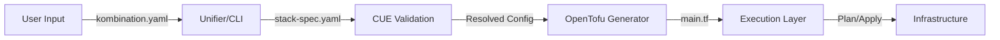

# StackKits Architecture

> **Version:** 2.0
> **Status:** Production Ready

## Overview

StackKits is a declarative infrastructure blueprint system that combines **CUE** for validation, **OpenTofu** for provisioning, and **Terramate** for orchestration. It strictly follows an **IaC-First** approach.

## High-Level Data Flow



## Layered Architecture

StackKits uses a modular three-layer architecture to maximize reuse.

### Layer 1: Core (Shared Schemas)

Located in `/base`, this layer defines the primitives:

- `stackkit.cue`: Base definition.
- `system.cue`, `network.cue`, `security.cue`: Core capabilities.
- `bootstrap/`, `lifecycle/`: Shared Terraform/Terramate templates.

### Layer 2: StackKits (Blueprints)

Located in specific directories (e.g., `/base-homelab`), these extend Layer 1:

- `stackfile.cue`: The main schema extension.
- `services.cue`: Default service lineup.
- `defaults.cue`: Opinionated defaults.
- `variants/`: OS (Ubuntu/Debian) and Compute (Low/High) variants.

### Layer 3: Add-ons (Extensions)

Located in `/addons` (or planned), these inject additional capabilities into a StackKit without modifying the core blueprint.

## Execution Model

### Dual-Mode IaC

The CLI supports two execution paths:

1.  **Simple Mode (Day 1)**
    - Uses pure **OpenTofu**.
    - Best for single-stack, single-server setups.
    - Lifecycle: `tofu init` -> `tofu plan` -> `tofu apply`.

2.  **Advanced Mode (Day 2)**
    - Uses **Terramate** to orchestrate OpenTofu.
    - Enables drift detection, change execution, and multi-stack management.
    - Lifecycle: `terramate run ...`.

## Directory Structure Strategy

```
/
├── base/                   # Layer 1: Shared Core
├── <stackkit-name>/        # Layer 2: Specific StackKits
├── addons/                 # Layer 3: Extending Components
├── cmd/                    # CLI Source Code (Go)
└── internal/               # Internal Logic Packages
    ├── cue/                # Schema Validation Engine
    ├── tofu/               # IaC Generator & Executor
    ├── terramate/          # Advanced Orchestration
    └── ...
```

    ## PaaS Selection Rule (Domain vs. No Domain)

    StackKits uses a simple default rule for the deployment platform layer:

    | Scenario | Default PaaS | Reason |
    |----------|-------------|--------|
    | No domain (LAN-only / port access) | Dokploy | Minimal DNS/SSL assumptions, simpler onboarding |
    | Own domain available | Coolify | Stronger multi-node story and domain-first workflows |

    This rule is a **default**, not a hard lock: the spec/variant can override it.
