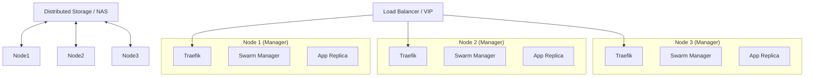

# High Availability Homelab StackKit

> ⚠️ **v1.2 PLANNED** - Not part of v1.0 or v1.1 releases
> 
> **Status:** Scaffolding Only  
> **Platform:** Docker Swarm (HA)  
> **License:** MIT

---

## ⚠️ Important Notice

**This StackKit is a vision document and scaffolding for future development.** It is not currently functional and should not be used for production deployments.

- **Target Release:** v1.2 (no timeline committed)
- **Current State:** Directory structure and documentation only
- **Dependencies:** Requires completion of v1.0 (base-homelab) and v1.1 (modern-homelab) first

---

## Vision Overview

The **ha-homelab** StackKit will provide an enterprise-grade, highly available homelab environment using **Docker Swarm** (not Kubernetes). It is designed for 3+ nodes to ensure redundancy, automatic failover, and zero-downtime updates.

### Why Docker Swarm (Not Kubernetes)?

- **Simplicity:** Docker Swarm is significantly simpler to operate than Kubernetes
- **Resource Efficient:** Lower overhead on homelab hardware
- **Docker Native:** Leverages existing Docker Compose knowledge
- **Sufficient for Homelab HA:** Provides the reliability needed without k8s complexity

Kubernetes support may be considered in a separate StackKit beyond v1.2.

## Planned Architecture

This StackKit will implement a 3-layer HA architecture:

1.  **Orchestration:** Docker Swarm with 3 managers (Quorum).
2.  **Storage:** Distributed storage (GlusterFS) or shared NAS constraints.
3.  **Networking:** Overlay networks with encrypted traffic and VIP failover (Keepalived).

## Planned Features

When implemented, this StackKit will provide:

- **High Availability:** Tolerates failure of 1 manager node without downtime.
- **PaaS:** Integrated **Dokploy** (Swarm Mode) for git-push deployments.
- **Observability:** HA Prometheus/Grafana stack using federation.
- **Storage:** Shared storage configuration templates.

## Target Requirements

| Resource     | Minimum | Recommended       |
| ------------ | ------- | ----------------- |
| **Nodes**    | 3       | 5 (3 Mgr + 2 Wkr) |
| **CPU/Node** | 2 Cores | 4+ Cores          |
| **RAM/Node** | 4 GB    | 8+ GB             |
| **Network**  | 1 Gbps  | 10 Gbps           |

## Planned Deployment Modes

- **Simple:** OpenTofu-only (limited drift detection).
- **Advanced (Recommended):** Terramate orchestration for managing updates across the cluster safely.

---

## Current Status

This directory contains:
- ✅ Basic scaffolding and documentation
- ✅ Vision architecture diagrams
- ❌ No functional templates yet
- ❌ No tested configurations
- ❌ Not ready for use

**For a working homelab deployment, use [base-homelab](../base-homelab/) or [modern-homelab](../modern-homelab/) instead.**
