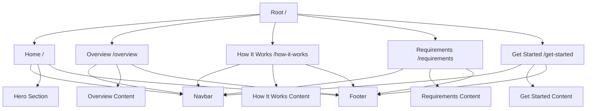

# StackKits Marketing Website - Redesign Architecture Plan

## Executive Summary

This document outlines the complete architecture redesign for the StackKits marketing website, transforming it from a single-page scroll-based design into a proper multi-page Single Page Application (SPA) with a clean, minimalist orange and white color scheme.

## Current State Analysis

### Problems Identified

1. **Mockup Image Misuse**: The Hero component directly embeds the mockup image ([`/mockup-web.png`](marketing/public/mockup-web.png)) as content instead of using it as design reference only.

2. **Wrong Color Scheme**: Current implementation uses blue color palette ([`primary`](marketing/tailwind.config.js:10-21)) instead of the required orange/white scheme.

3. **Overcrowded Homepage**: All content sections (Hero, Overview, HowItWorks, Requirements, GetStarted) are rendered on a single page in [`App.tsx`](marketing/src/App.tsx:14-18).

4. **No Multi-Page Structure**: The website uses anchor links with scroll-based navigation ([`Navbar.tsx`](marketing/src/components/Navbar.tsx:4-10)) instead of proper page routing.

5. **Title Duplication**: The Navbar displays "StackKits" text ([`Navbar.tsx:44`](marketing/src/components/Navbar.tsx:44)) alongside the logo which already contains the name.

### Current Technology Stack

- **Framework**: React 18.3.1
- **Build Tool**: Vite 5.4.10
- **Styling**: Tailwind CSS 3.4.14
- **Language**: TypeScript 5.6.2
- **Icons**: Lucide React 0.454.0
- **Animations**: Framer Motion 11.11.11

## Target Architecture

### Design System Specifications

#### Color Palette

The new design system will use only orange and white colors:

```css
/* Primary Orange - Main Brand Color */
orange-50:  #fff7ed
orange-100: #ffedd5
orange-200: #fed7aa
orange-300: #fdba74
orange-400: #fb923c
orange-500: #f97316  /* Primary brand color */
orange-600: #ea580c  /* Darker orange for hover states */
orange-700: #c2410c
orange-800: #9a3412
orange-900: #7c2d12

/* Neutral Grays - For text only */
gray-50:   #f9fafb
gray-100:  #f3f4f6
gray-200:  #e5e7eb
gray-300:  #d1d5db
gray-400:  #9ca3af
gray-500:  #6b7280
gray-600:  #4b5563
gray-700:  #374151
gray-800:  #1f2937
gray-900:  #111827

/* White */
white:     #ffffff
```

#### Design Principles

1. **Minimalism**: Use generous white space, avoid clutter
2. **Clean Typography**: Modern, readable fonts with clear hierarchy
3. **Orange as Accent**: Use orange for CTAs, links, and highlights only
4. **White Backgrounds**: All pages use white backgrounds for clean look
5. **No Mockup Images**: Use only design elements, not mockup screenshots

### Page Structure

The website will be restructured as a proper multi-page SPA with 5 distinct pages:



### Component Architecture

#### Core Components

1. **Layout Components**
   - `App.tsx` - Main application with routing
   - `Navbar.tsx` - Navigation with routing links (NO duplicate title)
   - `Footer.tsx` - Footer component

2. **Page Components**
   - `pages/Home.tsx` - Clean hero section only
   - `pages/Overview.tsx` - Product overview information
   - `pages/HowItWorks.tsx` - Process explanation
   - `pages/Requirements.tsx` - System requirements
   - `pages/GetStarted.tsx` - Getting started guide

3. **Reusable UI Components**
   - `components/Button.tsx` - Primary and secondary button variants
   - `components/Card.tsx` - Card container component
   - `components/Badge.tsx` - Status badges
   - `components/Section.tsx` - Section wrapper with consistent styling

#### Routing Structure

Using React Router v6+ for client-side routing:

```typescript
// Route Configuration
/                    -> Home page
/overview            -> Overview page
/how-it-works        -> How It Works page
/requirements        -> Requirements page
/get-started         -> Get Started page
```

### Detailed Page Specifications

#### 1. Home Page (`/`)

**Purpose**: Clean landing page with minimal content

**Components**:
- Navbar (logo only, no duplicate title)
- Hero Section (minimal, no mockup image)
- Footer

**Hero Section Requirements**:
- Clean, minimalist design
- NO mockup image as banner
- Orange/white color scheme
- Simple, clear messaging
- Logo only (no duplicate title)
- Single CTA button pointing to Get Started page

**Content Structure**:
```
Hero Section:
├── Logo (from /logo.png)
├── Headline: "Declarative Infrastructure for Your Homelab"
├── Subheadline: "Build, deploy, and manage your self-hosted infrastructure with validated blueprints."
└── CTA Button: "Get Started" (links to /get-started)
```

#### 2. Overview Page (`/overview`)

**Purpose**: Product overview and StackKit information

**Components**:
- Navbar
- Overview Content
- Footer

**Content Structure**:
```
Overview Page:
├── Section Header
│   ├── Title: "Choose Your StackKit"
│   └── Description: "From simple single-server setups to high-availability clusters"
├── StackKit Cards (3 cards)
│   ├── Base Homelab (Available)
│   ├── Modern Homelab (Planned)
│   └── HA Homelab (Planned)
└── Modal Component (for detailed view)
```

**Design Notes**:
- Use orange accent colors for Available status
- Use neutral colors for Planned status
- Clean card layout with generous spacing
- Modal for detailed information

#### 3. How It Works Page (`/how-it-works`)

**Purpose**: Process explanation

**Components**:
- Navbar
- How It Works Content
- Footer

**Content Structure**:
```
How It Works Page:
├── Section Header
│   ├── Title: "How StackKits Works"
│   └── Description: "Get your homelab up and running in four simple steps"
├── Process Steps (4 steps in grid)
│   ├── Step 1: Choose Your StackKit
│   ├── Step 2: Customize Configuration
│   ├── Step 3: Deploy with OpenTofu
│   └── Step 4: Manage & Scale
└── Additional Info Section
```

**Design Notes**:
- Step numbers in orange circles
- Clean, step-by-step visual flow
- Connector lines between steps (desktop)
- Orange accent for step icons

#### 4. Requirements Page (`/requirements`)

**Purpose**: System requirements

**Components**:
- Navbar
- Requirements Content
- Footer

**Content Structure**:
```
Requirements Page:
├── Section Header
│   ├── Title: "Technical Requirements"
│   └── Description: "Ensure your environment meets these requirements"
├── Requirements Grid (3 categories)
│   ├── Software Requirements
│   ├── Operating System Support
│   └── Network Requirements
├── Hardware Recommendations
│   ├── Base Homelab
│   ├── Modern Homelab
│   └── HA Homelab
└── Help Note Section
```

**Design Notes**:
- Required items in red/orange
- Supported items in green
- Clear visual hierarchy
- Orange accent for category icons

#### 5. Get Started Page (`/get-started`)

**Purpose**: Getting started guide

**Components**:
- Navbar
- Get Started Content
- Footer

**Content Structure**:
```
Get Started Page:
├── Section Header
│   ├── Title: "Get Started Today"
│   └── Description: "Ready to build your homelab?"
├── Quick Start Steps (4 steps)
│   ├── Clone the Repository
│   ├── Install Prerequisites
│   ├── Choose Your StackKit
│   └── Deploy & Enjoy
├── CTA Section
│   ├── Primary CTA: "View on GitHub"
│   └── Secondary CTA: "Explore StackKits"
├── Resources Section
│   ├── Documentation
│   ├── GitHub Repository
│   └── Community Support
└── Community Note Section
```

**Design Notes**:
- Orange CTA buttons
- Clean step cards
- Resource cards with hover effects
- Orange accent for icons

### Navigation Design

#### Navbar Specifications

**Logo Area**:
- Logo image only ([`/logo.png`](marketing/public/logo.png))
- NO duplicate "StackKits" text
- Links to home page (`/`)

**Navigation Links** (Desktop):
- Home (`/`)
- Overview (`/overview`)
- How It Works (`/how-it-works`)
- Requirements (`/requirements`)
- Get Started (`/get-started`) - Orange CTA button

**Navigation Links** (Mobile):
- Hamburger menu
- Same links as desktop
- Collapsible menu

**Styling**:
- White background
- Orange accent for active link
- Orange CTA button
- Clean, minimalist design

### File Structure

```
marketing/
├── public/
│   ├── logo.png              # Keep (logo contains "StackKits" text)
│   └── mockup-web.png        # Keep (for design reference only, NOT to be used)
├── src/
│   ├── App.tsx               # Rewrite with routing
│   ├── main.tsx              # Keep (entry point)
│   ├── index.css             # Update with orange colors
│   ├── components/
│   │   ├── Navbar.tsx        # Remove duplicate title, update links to routes
│   │   ├── Footer.tsx        # Keep (may need minor updates)
│   │   ├── Button.tsx        # NEW - Reusable button component
│   │   ├── Card.tsx          # NEW - Reusable card component
│   │   ├── Badge.tsx         # NEW - Status badge component
│   │   └── Section.tsx       # NEW - Section wrapper component
│   ├── pages/
│   │   ├── Home.tsx          # NEW - Clean hero page
│   │   ├── Overview.tsx      # NEW - Overview page content
│   │   ├── HowItWorks.tsx    # NEW - How it works page content
│   │   ├── Requirements.tsx # NEW - Requirements page content
│   │   └── GetStarted.tsx    # NEW - Get started page content
│   └── lib/
│       └── utils.ts          # Keep (utility functions)
├── tailwind.config.js       # Update with orange color palette
├── package.json              # Add react-router-dom
└── vite.config.ts            # Keep (may need updates for SPA)
```

### Technical Implementation Plan

#### Phase 1: Setup and Configuration

1. **Install React Router**
   ```bash
   npm install react-router-dom
   ```

2. **Update Tailwind Configuration**
   - Replace blue `primary` colors with orange palette
   - Add custom color tokens for orange shades
   - Update utility classes to use orange accents

3. **Update CSS Variables**
   - Remove blue color references
   - Add orange color tokens
   - Update button styles to use orange

#### Phase 2: Create Page Components

1. **Create `pages/Home.tsx`**
   - Minimal hero section
   - NO mockup image
   - Orange CTA button
   - Clean, minimalist design

2. **Create `pages/Overview.tsx`**
   - Migrate content from existing `Overview.tsx` component
   - Update colors to orange/white scheme
   - Keep modal functionality

3. **Create `pages/HowItWorks.tsx`**
   - Migrate content from existing `HowItWorks.tsx` component
   - Update colors to orange/white scheme
   - Update step icons to use orange

4. **Create `pages/Requirements.tsx`**
   - Migrate content from existing `Requirements.tsx` component
   - Update colors to orange/white scheme
   - Update required item indicators

5. **Create `pages/GetStarted.tsx`**
   - Migrate content from existing `GetStarted.tsx` component
   - Update colors to orange/white scheme
   - Update CTA buttons to orange

#### Phase 3: Create Reusable Components

1. **Create `components/Button.tsx`**
   - Primary button (orange background)
   - Secondary button (white with orange border)
   - Consistent styling across all pages

2. **Create `components/Card.tsx`**
   - Card container with shadow
   - Hover effects
   - Consistent padding and spacing

3. **Create `components/Badge.tsx`**
   - Status badges (Available, Planned, Required, Supported)
   - Orange for active/available states
   - Green for supported states

4. **Create `components/Section.tsx`**
   - Section wrapper with consistent padding
   - Optional header component
   - Consistent max-width and centering

#### Phase 4: Update Layout Components

1. **Update `components/Navbar.tsx`**
   - Remove duplicate "StackKits" text (line 44)
   - Update links to use React Router routes
   - Update active link styling to use orange
   - Update CTA button to use orange

2. **Update `components/Footer.tsx`**
   - Review and update colors to orange/white scheme
   - Update links to use React Router routes

#### Phase 5: Update Main Application

1. **Rewrite `App.tsx`**
   - Add React Router setup
   - Define routes for all 5 pages
   - Wrap with BrowserRouter
   - Add error boundary

2. **Update `index.css`**
   - Remove blue color references
   - Add orange color tokens
   - Update button utility classes
   - Update gradient text to use orange

### Design Token System

#### Color Tokens

```css
/* Primary Orange */
--color-orange-50: #fff7ed;
--color-orange-100: #ffedd5;
--color-orange-200: #fed7aa;
--color-orange-300: #fdba74;
--color-orange-400: #fb923c;
--color-orange-500: #f97316;  /* Primary brand color */
--color-orange-600: #ea580c;  /* Hover state */
--color-orange-700: #c2410c;
--color-orange-800: #9a3412;
--color-orange-900: #7c2d12;

/* Neutral Grays */
--color-gray-50: #f9fafb;
--color-gray-100: #f3f4f6;
--color-gray-200: #e5e7eb;
--color-gray-300: #d1d5db;
--color-gray-400: #9ca3af;
--color-gray-500: #6b7280;
--color-gray-600: #4b5563;
--color-gray-700: #374151;
--color-gray-800: #1f2937;
--color-gray-900: #111827;

/* White */
--color-white: #ffffff;
```

#### Typography Tokens

```css
/* Font Sizes */
--text-xs: 0.75rem;      /* 12px */
--text-sm: 0.875rem;     /* 14px */
--text-base: 1rem;       /* 16px */
--text-lg: 1.125rem;     /* 18px */
--text-xl: 1.25rem;      /* 20px */
--text-2xl: 1.5rem;      /* 24px */
--text-3xl: 1.875rem;    /* 30px */
--text-4xl: 2.25rem;     /* 36px */
--text-5xl: 3rem;        /* 48px */

/* Font Weights */
--font-normal: 400;
--font-medium: 500;
--font-semibold: 600;
--font-bold: 700;
```

#### Spacing Tokens

```css
/* Spacing Scale */
--space-1: 0.25rem;      /* 4px */
--space-2: 0.5rem;       /* 8px */
--space-3: 0.75rem;      /* 12px */
--space-4: 1rem;         /* 16px */
--space-6: 1.5rem;       /* 24px */
--space-8: 2rem;         /* 32px */
--space-12: 3rem;        /* 48px */
--space-16: 4rem;        /* 64px */
--space-20: 5rem;        /* 80px */
```

#### Component Tokens

```css
/* Buttons */
--btn-primary-bg: var(--color-orange-500);
--btn-primary-bg-hover: var(--color-orange-600);
--btn-primary-text: var(--color-white);
--btn-secondary-bg: var(--color-white);
--btn-secondary-bg-hover: var(--color-gray-100);
--btn-secondary-text: var(--color-gray-700);
--btn-secondary-border: var(--color-gray-300);

/* Cards */
--card-bg: var(--color-white);
--card-shadow: 0 1px 3px rgba(0, 0, 0, 0.1);
--card-shadow-hover: 0 10px 25px rgba(0, 0, 0, 0.15);
--card-border-radius: 1rem;

/* Badges */
--badge-available-bg: var(--color-orange-100);
--badge-available-text: var(--color-orange-700);
--badge-planned-bg: var(--color-gray-100);
--badge-planned-text: var(--color-gray-700);
--badge-required-bg: #fee2e2;
--badge-required-text: #dc2626;
--badge-supported-bg: #dcfce7;
--badge-supported-text: #16a34a;
```

### Responsive Design Strategy

#### Breakpoints

```css
/* Mobile First Approach */
--breakpoint-sm: 640px;   /* Small tablets */
--breakpoint-md: 768px;   /* Tablets */
--breakpoint-lg: 1024px;  /* Small laptops */
--breakpoint-xl: 1280px;  /* Desktops */
--breakpoint-2xl: 1536px; /* Large screens */
```

#### Mobile Considerations

1. **Navigation**
   - Hamburger menu on mobile
   - Full-screen menu overlay
   - Easy tap targets (minimum 44px)

2. **Content Layout**
   - Single column on mobile
   - Stack cards vertically
   - Increase touch spacing

3. **Typography**
   - Scale font sizes appropriately
   - Maintain line height for readability
   - Avoid text truncation

### Accessibility Considerations

1. **Color Contrast**
   - Ensure orange text on white meets WCAG AA (4.5:1)
   - Ensure white text on orange meets WCAG AA (4.5:1)

2. **Keyboard Navigation**
   - All interactive elements keyboard accessible
   - Visible focus indicators (orange outline)
   - Logical tab order

3. **Screen Reader Support**
   - Proper ARIA labels
   - Semantic HTML structure
   - Alt text for images

4. **Reduced Motion**
   - Respect `prefers-reduced-motion`
   - Provide alternatives to animations

### Performance Considerations

1. **Code Splitting**
   - Lazy load page components
   - Use React Router lazy loading
   - Split vendor bundles

2. **Image Optimization**
   - Use WebP format where supported
   - Lazy load images
   - Responsive images with srcset

3. **CSS Optimization**
   - Purge unused Tailwind classes
   - Minimize custom CSS
   - Use CSS-in-JS sparingly

### Migration Checklist

#### Must Do (Critical)

- [ ] Install `react-router-dom` dependency
- [ ] Update `tailwind.config.js` with orange color palette
- [ ] Remove mockup image from Hero component
- [ ] Remove duplicate "StackKits" text from Navbar
- [ ] Create `pages/` directory structure
- [ ] Create 5 page components (Home, Overview, HowItWorks, Requirements, GetStarted)
- [ ] Rewrite `App.tsx` with React Router setup
- [ ] Update `index.css` with orange color tokens
- [ ] Update Navbar links to use routes instead of anchor links
- [ ] Create reusable UI components (Button, Card, Badge, Section)

#### Should Do (Important)

- [ ] Update all color references from blue to orange
- [ ] Ensure consistent spacing across all pages
- [ ] Add proper page transitions
- [ ] Implement error boundaries
- [ ] Add loading states for route transitions
- [ ] Update Footer links to use routes
- [ ] Test responsive design on all breakpoints
- [ ] Verify accessibility compliance

#### Nice to Have (Enhancements)

- [ ] Add page-specific metadata
- [ ] Implement smooth scroll behavior
- [ ] Add breadcrumb navigation
- [ ] Create animation library for page transitions
- [ ] Add analytics tracking
- [ ] Implement SEO optimizations

### Testing Strategy

1. **Unit Testing**
   - Test all page components
   - Test reusable UI components
   - Test routing logic

2. **Integration Testing**
   - Test navigation between pages
   - Test Navbar routing
   - Test Footer links

3. **Visual Regression Testing**
   - Test color consistency
   - Test responsive layouts
   - Test component variations

4. **Accessibility Testing**
   - Test keyboard navigation
   - Test screen reader compatibility
   - Test color contrast

### Deployment Considerations

1. **Build Configuration**
   - Ensure Vite builds correctly with React Router
   - Configure proper base path if needed
   - Optimize bundle size

2. **Server Configuration**
   - Configure SPA fallback routing
   - Enable gzip compression
   - Set proper cache headers

3. **CDN Configuration**
   - Serve static assets from CDN
   - Configure cache policies
   - Enable HTTPS

## Conclusion

This architecture plan provides a comprehensive roadmap for transforming the StackKits marketing website into a clean, minimalist, multi-page SPA with an orange and white color scheme. The plan addresses all identified problems and provides detailed specifications for implementation.

### Key Deliverables

1. Multi-page SPA with 5 distinct pages
2. Orange and white color scheme throughout
3. Clean, minimalist design with generous white space
4. Proper routing with React Router
5. No duplicate titles or mockup images
6. Reusable UI component library
7. Responsive design for all screen sizes
8. Accessible and performant implementation

### Success Criteria

- All 5 pages render correctly with proper routing
- Orange color scheme applied consistently
- No mockup images used as content
- No duplicate "StackKits" text in Navbar
- Clean, minimalist design with ample white space
- Responsive design works on all breakpoints
- Accessibility standards met
- Performance benchmarks achieved
